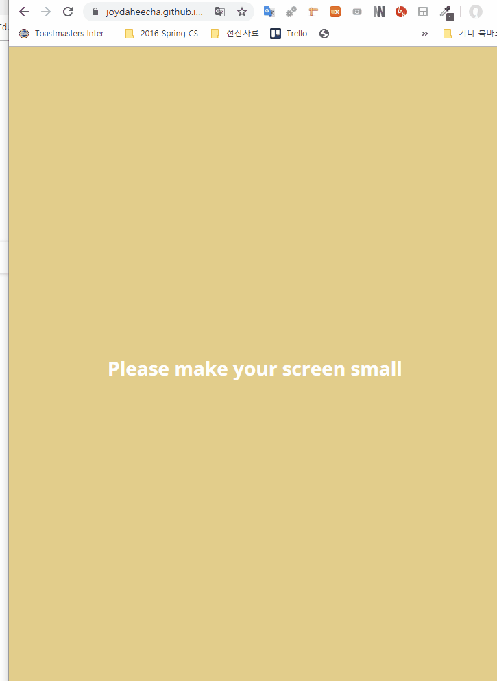

# kakao-clone
---
## Demo Link
https://joydaheecha.github.io/kakao-clone/

## Demo Video

## Project Description 
Hello. Thank you for having interest in my Kakao-clonning project.  
This is a Toy project that I did in Nomad Academy purposing to practice HTML and CSS.  
If the screen size is too big, the browser will request you to resize the screen.  
Project pages are consist of  
- friends list
- chat list
    - chat
- news
- more  

HTML과 CSS 연습 목적으로 만든 카카오 메신저 클로닝 프로젝트입니다.  
화면이 너무 클 경우 줄여주도록 사용자에게 요청합니다.  
프로젝트 페이지 구성은 다음과 같습니다.  
- 친구목록
- 채팅목록
    - 채팅
- 뉴스
- 더보기

## Customization: How to run this project
Very simple. Download the project folder and execute index.html file.  
프로젝트를 로컬컴퓨터에 다운로드 하신후 index.html 파일을 클릭하시면 실행 가능합니다. 

## What I used for this project 
- CSS
- HTML

